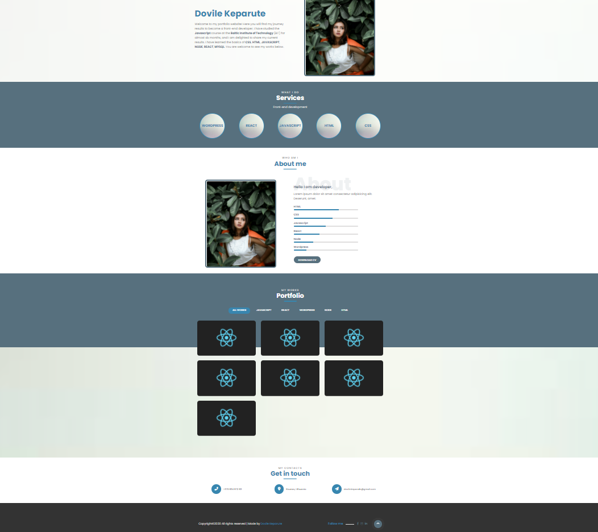

# Portfolio
## About

This is one of the projects for the Javascript trainings. 

## Objectives
- Responsive design
- Javscript
- CSS animations
- NodeJs

## Authors
Student | Description
------- | -----------
Dovile Keparute | Homework No.4 "Coming-soon"
